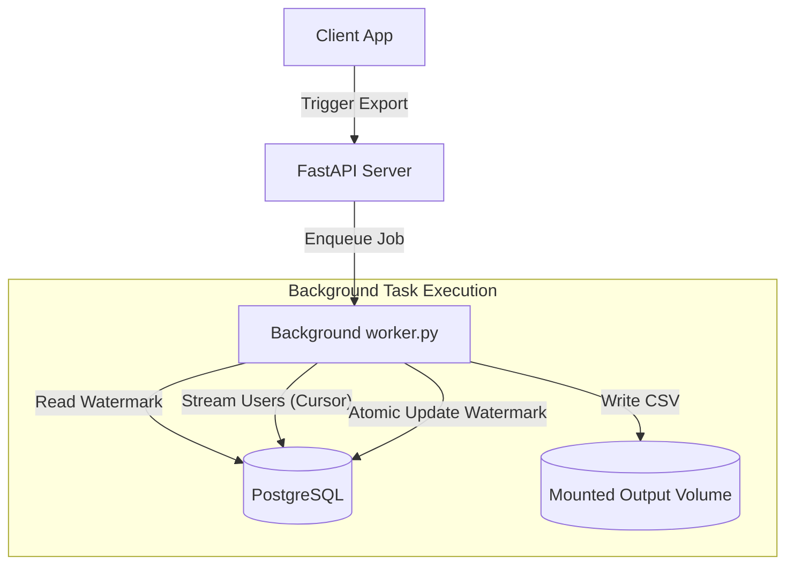

# Change Data Capture (CDC) Incremental Export System

A production-ready, containerized log-based application-level Change Data Capture (CDC) incremental data export system built with Python, FastAPI, and PostgreSQL 13.

## 🏗️ Architecture & Core Design Patterns

This system exposes APIs to manage data synchronizations from a core transactional PostgreSQL database to downstream file outputs (CSV). It is built with high-throughput, resilience, and data integrity at the forefront.



### 1. Change Data Capture (CDC) & Soft Deletes
Downstream synchronization demands tracking updates and deletions:
* **Incremental Synchronization**: Identifies rows modified since the last synchronization using the consumer's watermark.
* **Delta Synchronization**: Extends incremental tracking by including soft-deleted users (where `is_deleted = TRUE`), labeling each exported row with its CDC operational tag:
  * `DELETE` if the user is soft-deleted.
  * `INSERT` if `created_at == updated_at`.
  * `UPDATE` if `created_at != updated_at`.

### 2. High-Performance Watermarking & Transactional Atomicity
To achieve data synchronization guarantees:
* **Consumer-Level Watermarking**: The system keeps a high-water mark (`last_exported_at`) tracking the maximum `updated_at` value among exported records for each `consumer_id`.
* **Transactional Atomicity**: If a background export task fails (e.g. database disconnect, file write failure, validation error), the watermark update transaction is automatically rolled back. The partial CSV file is cleaned up, preventing downstream corruption.

### 3. Memory Safety: O(1) Streaming Cursors
For large datasets (100,000+ records), loading all rows into Python's RAM at once causes massive memory spikes and potential Out-Of-Memory (OOM) crashes.
* This pipeline implements async cursors via `asyncpg.Connection.cursor()`, which streams rows directly from the PostgreSQL engine in micro-batches.
* The API writes results line-by-line to disk, ensuring a stable, flat memory overhead of **O(1)** regardless of table size.

---

## 🚀 Setup & Execution

### 1. Build and Run the Stack
Start the containerized stack (PostgreSQL database + FastAPI application + Automatic Seeding of 105,000 users) in detached mode:
```bash
docker-compose up -d --build
```

### 2. Seeding Verification
The database service automatically runs the schema migration and seeds **105,000 records** distributed across 15 days, with exactly **1.5% soft-deleted users**.
You can verify the database state via:
```bash
docker-compose exec db psql -U postgres -d postgres -c "SELECT COUNT(*) FROM users;"
```

---

## 🔌 API Documentation

| Method | Endpoint | Description |
| :--- | :--- | :--- |
| **GET** | `/health` | Application status check |
| **POST** | `/exports/full` | Triggers a full export of non-deleted users |
| **POST** | `/exports/incremental` | Triggers an incremental export for users updated since the watermark |
| **POST** | `/exports/delta` | Triggers a delta export (including soft-deletes with operation tags) |
| **GET** | `/exports/watermark` | Retrieves the current high-water mark for the consumer |

> [!IMPORTANT]
> All `/exports/*` endpoints require the **`X-Consumer-ID`** header. If the header is missing, empty, or whitespace-only, the system returns a `400 Bad Request` instead of FastAPI's default 422 error.

### Example Run Workflow

1. **Trigger a Full Export**:
   ```bash
   curl -X POST http://localhost:8080/exports/full \
     -H "X-Consumer-ID: marketing-team"
   ```
   **Response (`202 Accepted`)**:
   ```json
   {
     "jobId": "e1bfa82a-dc9d-472e-83b6-7eb75cb7be99",
     "status": "started",
     "exportType": "full",
     "outputFilename": "full_marketing-team_1716301200.csv"
   }
   ```

2. **Retrieve the High-Water Mark**:
   ```bash
   curl -X GET http://localhost:8080/exports/watermark \
     -H "X-Consumer-ID: marketing-team"
   ```
   **Response (`200 OK`)**:
   ```json
   {
     "consumerId": "marketing-team",
     "lastExportedAt": "2026-05-20T22:50:00Z"
   }
   ```

3. **Trigger an Incremental Export**:
   ```bash
   curl -X POST http://localhost:8080/exports/incremental \
     -H "X-Consumer-ID: marketing-team"
   ```

---

## 🧪 Testing Suite & Coverage Report

The project features integration and unit test coverage matching 100% contract compliance.

### Run Tests Inside the Container
To run all tests and print the coverage report inside the running application container:
```bash
docker-compose exec app pytest --cov=app tests/ -v
```

This generates a terminal coverage summary of the `app/` modules. To output a detailed HTML report, run:
```bash
docker-compose exec app pytest --cov=app --cov-report=html tests/
```
The report will be available in the local directory `htmlcov/index.html`.
